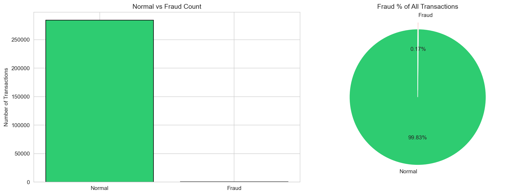
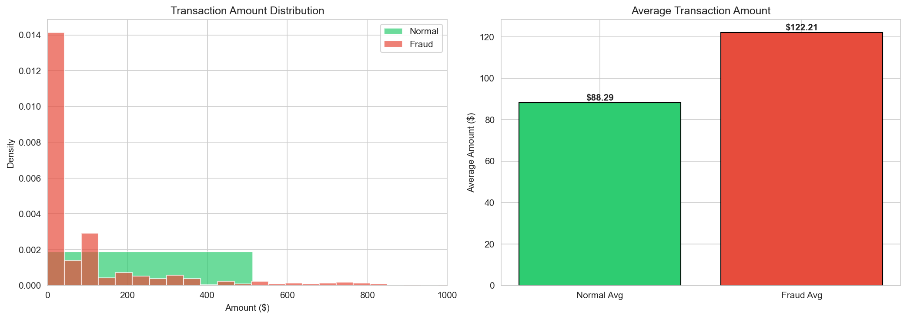
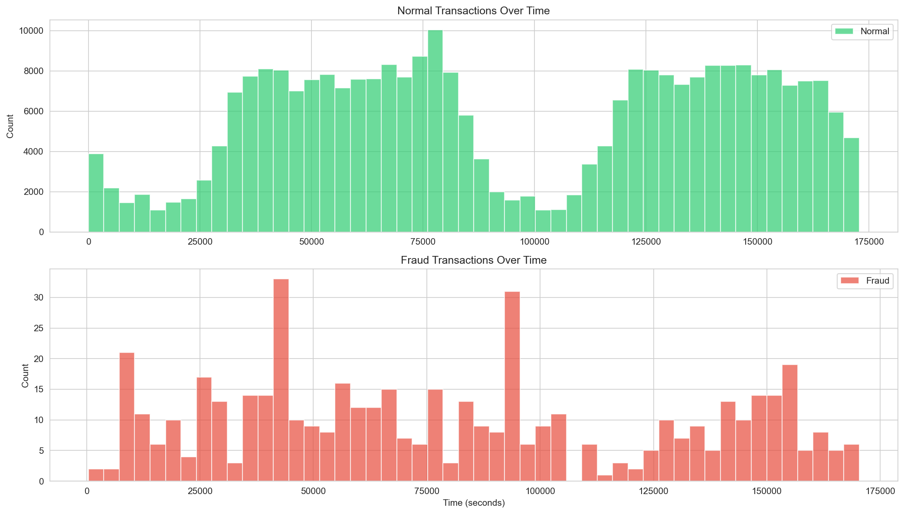
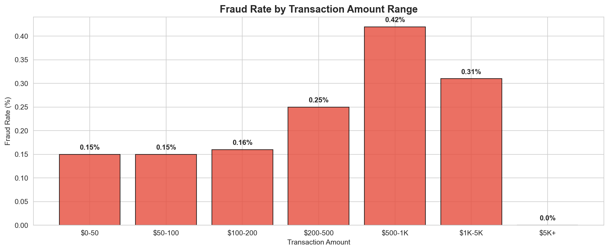

# 💳 Credit Card Fraud Detection
> Analyzed 284,807 financial transactions to detect fraud patterns, anomalies, and high-risk behaviours — directly applicable to fraud controls and transaction monitoring workflows.

---

## The Big Findings

- **2am is the most dangerous hour** — fraud rate peaks at 2.55%, nearly 10x the dataset average
- **$500–$1K is the highest risk amount range** — consistent with threshold manipulation to evade bank controls
- **100% fraud rate clusters detected** — 4 fraudulent transactions in the same second totalling $1.00, consistent with automated card testing
- **$0.00 fraud transactions found** — indicates card testing behaviour, verifying stolen cards before larger purchases
- **Fraud averages $122 vs $88 for normal** — fraudsters spend 38% more per transaction

---

## 🕵️‍♀️ How I Found This

1. Loaded and explored 284,807 transactions — confirmed only 0.17% are fraud (class imbalance)
2. Compared fraud vs normal transaction amounts — found fraud clusters in $500–$1K range
3. Analyzed transactions over time — discovered late night fraud spikes
4. Grouped by second — uncovered bot activity and card testing patterns
5. Broke down fraud rate by hour — pinpointed 2am as peak fraud window

---

## 📊 Visualizations

### Fraud vs Normal Transactions

### Transaction Amount Distribution

### Fraud Patterns Over Time

### Fraud Rate by Amount Range

---

## 💡 What I'd Tell the Fraud Team

1. **Set real-time alerts for 2am–3am** — fraud rate is nearly 10x higher, warrants increased monitoring
2. **Flag $500–$1K transactions for review** — highest fraud concentration by amount range
3. **Block $0.00 authorisation attempts** — strong indicator of card testing before larger fraud
4. **Implement velocity checks** — flag any card with 3+ transactions in the same second

---

## 🛠️ What I Built

| File | Description |
|---|---|
| `fraud_detection_starter.ipynb` | Full Python analysis with visualizations |
| `fraud_queries.sql` | 3 SQL queries for fraud pattern detection |
| `chart1_fraud_vs_normal.png` | Fraud vs normal transaction count |
| `chart2_transaction_amounts.png` | Amount distribution comparison |
| `chart3_fraud_over_time.png` | Fraud patterns across time |
| `chart4_fraud_by_amount.png` | Fraud rate by amount range |

---

## 📂 Dataset

**Credit Card Fraud Detection** by ULB Machine Learning Group
- 284,807 transactions over 2 days
- 492 fraud cases (0.17%)
- Download from [Kaggle](https://www.kaggle.com/datasets/mlg-ulb/creditcardfraud)

---

## 🎓 What I Learned

- **Class imbalance is real** — 0.17% fraud means you can't just look at accuracy
- **Time matters** — when a transaction happens is as important as how much it is
- **$0 is suspicious** — the smallest transactions can signal the biggest fraud
- **SQL + Python together** — combining both gives you the full picture
